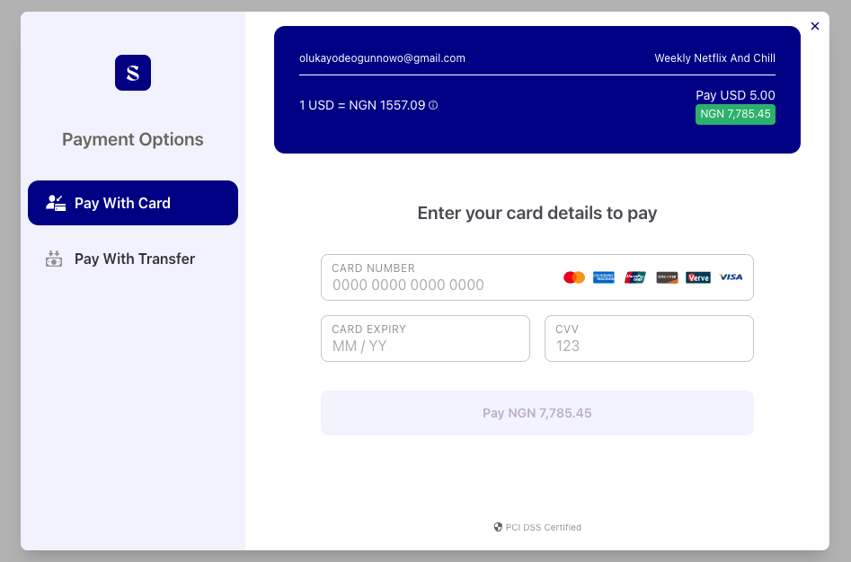

# Spotflow Checkout Vue.Js

This **Spotflow Vue.js library** wraps around the [inline library](https://github.com/Spotflow-One/spotflow-checkout-inline), which enables users to make payments seamlessly.
It integrates smoothly into your Vue.js application, providing a streamlined checkout experience.

Available Features:

- Collections: Card, Bank Transfers, USSD
- Recurring payments: Tokenization and Subscriptions.

## Table of Contents

1. [Requirements](#requirements)

## Requirements

1. Spoflow Encryption keys
2. Spotflow API keys
3. Node versions >= 16.x.x npm >=7.x.x

## Demo



## Installation

To install the library, you can use either Yarn or npm. Choose the one that fits your project setup:

### Using Yarn

```bash
  yarn add @spot-flow/vue-spotflow-checkout
 ```

### Using NPM

```bash
  npm install @spot-flow/vue-spotflow-checkout
 ```

## Usage

 ```javascript
<template>
  <button @click="makePayment">
    <slot></slot>
  </button>
</template>

<script lang="ts">
declare global {
  interface Window {
    SpotflowCheckout: {
      CheckoutForm: any
    }
  }
}
export default {
  name: 'VueSpotflow',
  props: {
    merchantKey: {
      type: String,
      required: true
    },
    email: {
      type: String,
      required: true
    },
    amount: {
      type: Number,
      required: true
    },
    encryption: {
      type: String,
      required: true
    },
    planId: {
      type: String,
      required: true
    }
  },
  beforeMount() {
    const script = document.createElement('script')
    script.src = 'https://dr4h9151gox1m.cloudfront.net/dist/checkout-inline.js'
    script.onload = () => {
      console.log('Library loaded')
    }
    document.head.appendChild(script)
  },

  methods: {
    makePayment() {
      if (this.merchantKey === undefined || this.email === undefined ) {
        throw new Error('Merchant key, email and amount are required')
      }
      const checkout = window.SpotflowCheckout
      if (checkout) {
        const payload = {
        merchantKey: this.merchantKey,
        encryptionKey: this.encryption,
        planId: this.planId,
        email: this.email,
        amount: this.amount || 0,
      }
        //  constructor(merchantKey: string, encryption: string, email: string, amount: number, planId: string) {
        const payment = new checkout.CheckoutForm(payload)
        payment.setup(payload)
      }
    }
  }
}
</script>


  
 ```

### Parameters

Read more about our parameters and how they can be used [here](https://developer.flutterwave.com/docs/collecting-payments/inline).

| Parameter           | Always Required ? |Description     |
| ------------------- | ----------------- | ---------------------------------------------------------------------------------------------------------------------------------------------------------------------------------------------------------------------------------------------- |
| merchantKey         | True              | Your API secret |
| reference           | False             | Your transaction reference. This MUST be unique for every transaction  |
| amount              | False              | Amount to charge the customer. NB: this most likely comes from the plan details    |
| currency            | False             | currency to charge in. Defaults to NGN                 |
| encryptionKey       | True               | This is the encryption key for the merchant |
| planId   | True | This is the plan id being paid for  |
| firstname | False | This is the Customer Preview Name |
| lastname | False | This is the Customer Preview Last Name |
| regionId | False | this is the merchant's region where the customer is subscribed to |
| phone | False | This is the phone numbern of the customer |

## Contribting Guidelines

We welcome contributions from the community. Read more about our community contribution guidelines [here](/CONTRIBUTION.md).

## Supports

## License

By contributing to this library, you agree that your contributions will be licensed under its [MIT license](/LICENSE).

Copyright (c) Spotflow Inc.

## Contributors

- [Olukayode Ogunnowo](http://github.com/dansagam)
- [Oluwatosin Jimoh](https://github.com/ekiira)
