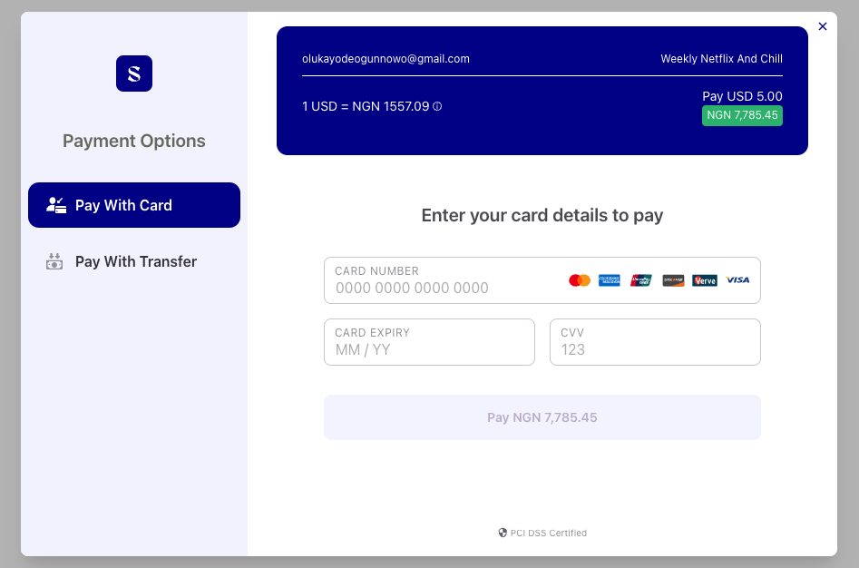

# Spotflow Checkout Vue.Js

This **Spotflow Vue.js library** wraps around the [inline library](https://github.com/Spotflow-One/spotflow-checkout-inline), which enables users to make payments seamlessly.
It integrates smoothly into your Vue.js application, providing a streamlined checkout experience.

Available Features:

- Collections: Card, Bank Transfers, USSD
- Recurring payments: Tokenization and Subscriptions.

## Table of Contents

1. [Requirements](#requirements)
2. [Installation](#installation)
3. [Usage](#usage)

## Requirements

1. Spoflow API key
2. Spotflow Encryption key
3. Node versions >= 16.x.x npm >=7.x.x

## Demo



## Installation

To install the library, you can use either Yarn, NPM or PNPM. Choose the one that fits your project setup:

### Using Yarn

```bash
yarn add @spot-flow/vue-spotflow-checkout
 ```

### Using NPM

```bash
npm install @spot-flow/vue-spotflow-checkout
 ```

## Usage
This library can be implemented using the following

1. By Using Composable (Recommended)
2. By SpotflowButton Component

### 1. Using Composable 
The composable approach gives you full control and flexibility.

 in ```payment-component.vue```
 ```javascript
  <script setup>
    import { useSpotflowPayment } from '@spot-flow/vue-spotflow-checkout'

    const loadSpotflow = useSpotflowPayment()

    const handlePayment = async () => {
      const config = {
        amount: 4000, // Not required for subscription payment
        currency: "NGN",
        email: "temi@mailinator.com", // Email of customer
        name: "John", // Name of customer: Not required
        phoneNumber: "09090909090", // Phone number of customer: Not required
        reference: "MC-123456", // Not required, a unique payment reference will be generated if not provided
        merchantKey: "sk_test_fXXXXedhXXXXXXXXXXXXXXXX",
        planId: "9e0808304-344d-XXXXXXXXX-XXXXX834034", // Not required for a one time payment
        encryptionKey:"SKKXXXXXXXXXXXXXXXXX"
      }
        await loadSpotflow(config)
    }
  </script>

  <template>
    <div>
    <button @click="handlePayment">
      Make Payment
    </button>
    </div>
  </template>
 ```

 ### 1. Using SpotflowButton Component in Vue 3
 in ```payment-component.vue```
 ```javascript
 <script setup lang="ts">

import { SpotflowButton } from "@spot-flow/vue-spotflow-checkout";
import { defineComponent, ref } from "vue";

const config = {
  amount: 4000, // Not required for subscription payment
  currency: "NGN",
  email: "temi@mailinator.com", // Email of customer
  name: "John", // Name of customer: Not required
  phoneNumber: "09090909090", // Phone number of customer: Not required
  reference: "MC-123456", // Not required, a unique payment reference will be generated if not provided
  merchantKey: "sk_test_fXXXXedhXXXXXXXXXXXXXXXX",
  planId: "9e0808304-344d-XXXXXXXXX-XXXXX834034", // Not required for a one time payment
  encryptionKey:"SKKXXXXXXXXXXXXXXXXX"
};
</script> 

<template>
  <h1>Payment Component</h1>
  <div>
    <!-- Just need to click the button -->
    <SpotflowButton :config="config">
       Pay Now
    </SpotflowButton>

  </div>
</template>
```

### Parameters

Read more about our parameters and how they can be used [here](https://docs.spotflow.one/Developer%20Tools/inline-js).

| Parameter           | Required |Description     |
| ------------------- | ----------------- | ---------------------------------------------------------------------------------------------------------------------------------------------------------------------------------------------------------------------------------------------- |
| merchantKey         | True              | Your API Secret |
| reference           | False             | Your transaction reference. This MUST be unique for every transaction  |
| amount              | False              | Amount to charge the customer. NB: For subscription payments, amount comes from the plan details. This is not required for subscription payments.   |
| currency            | True             | Currency to charge in.           |
| localCurrency       | False            | This is only required when a payment is being made in USD  |
| encryptionKey       | True               | This is the encryption key for the merchant. This is required for card payments. |
| planId   | False | This is the plan ID being paid for however, this is not required for one time payments.   |
| name | False | This is the Customer's Name |
| phoneNumber | False | This is the Customer's Phone Number |
| email | True | This is the Customer's Email Address |
| metadata | True | This contains other information about the product such as the product name and other additional properties. Product Name should not be passed if planId is being passed |
| callBackUrl | False | This is the URL the browser redirects to on success of a payment |


# 🎉 Spotflow Hacktoberfest 2025

Welcome to **Spotflow’s open-source repositories** — part of this year’s **Hacktoberfest Challenge** by DigitalOcean!

Spotflow is a global **Merchant of Record (MoR)** that simplifies payment processing for businesses worldwide.  
We handle everything from global payment acceptance to compliance and settlement — empowering merchants to go global effortlessly.

## 🚀 How to Participate

1. Register for Hacktoberfest at [hacktoberfest.com](https://hacktoberfest.com)
2. Fork this repository.
3. Choose an issue labeled **`hacktoberfest`** or **`good first issue`**.
4. Make your contribution (see [Contributing Guidelines](./CONTRIBUTING.md)).
5. Open a pull request (PR) and add a **`hacktoberfest-accepted`** label to your PR.
6. Once approved and merged — it counts toward your Hacktoberfest goal!

## 💡 What You Can Contribute
- Improve or add SDK functionality  
- Write or improve API documentation 
- Spot bugs/improvements and write new issues (use [Issues Template](./ISSUE_TEMPLATE.md) as a guide).
- Add new language SDKs (Python, JS, Java, etc.)  
- Fix typos, formatting, or examples  
- Write tutorials or integration guides  

## 📅 Important Dates
- **Event:** October 1 – October 31, 2025
- **Application Deadline:** October 31, 2025

## 🧠 Resources
- Docs: [https://docs.spotflow.one](https://docs.spotflow.one)
- API Playground: [https://www.spotflow.one/demo](https://www.spotflow.one/demo)
- Sign up: [Spotflow Hacktoberfest Form](https://forms.gle/5KXXiy7mR35ocahL6)
